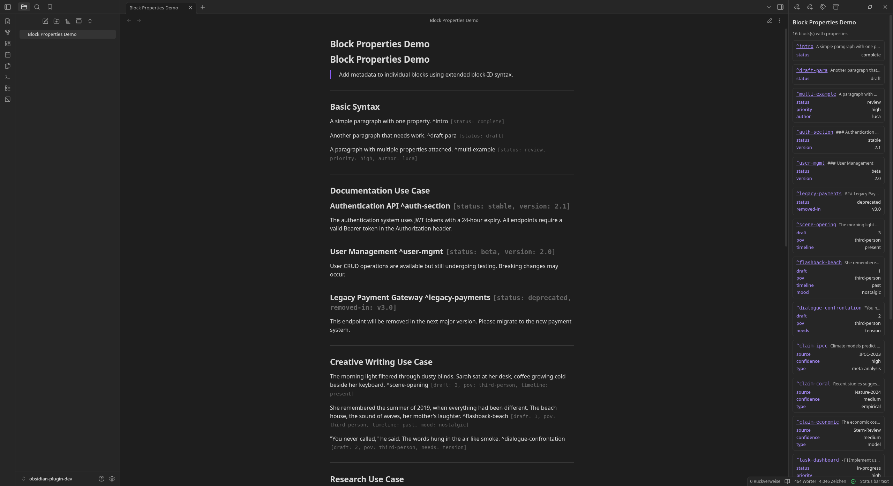
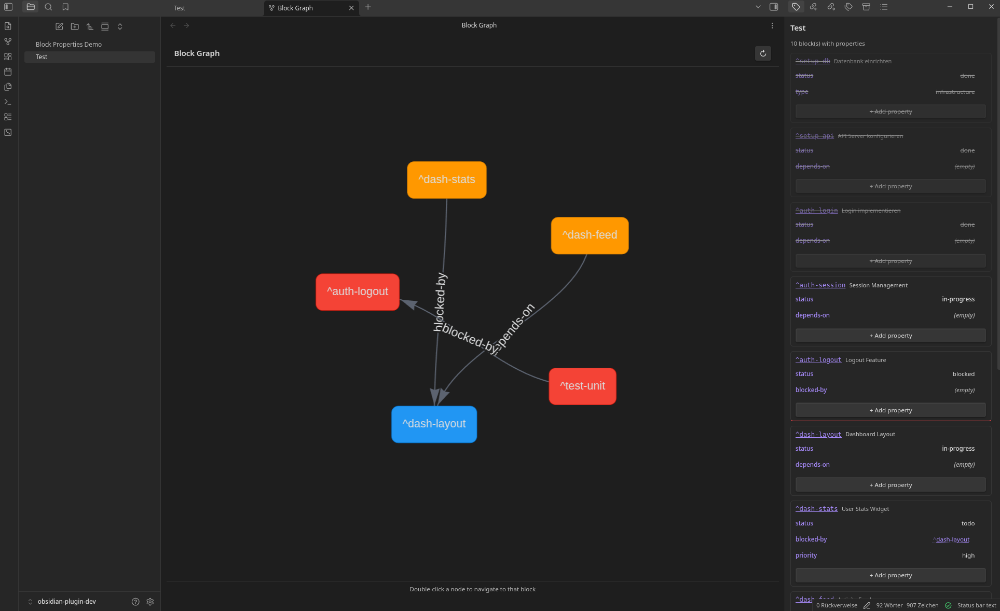
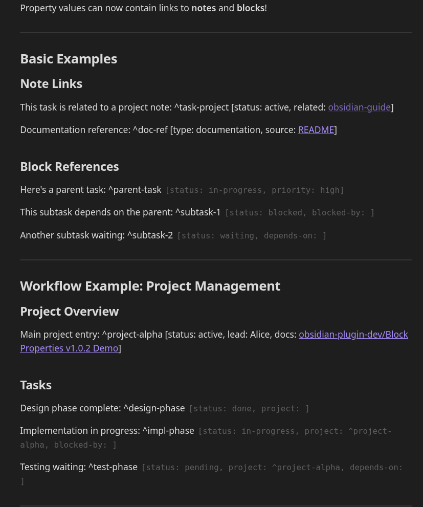
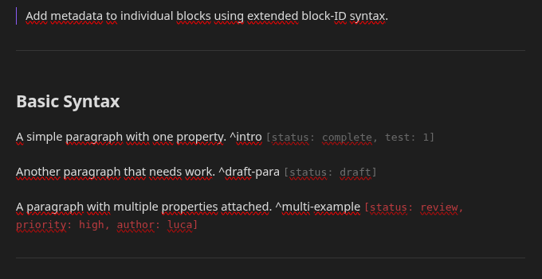
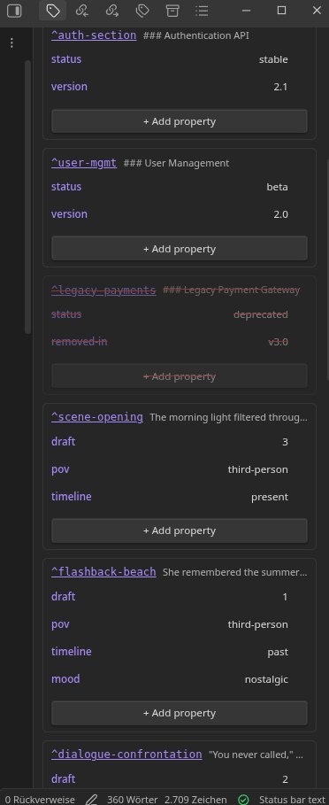
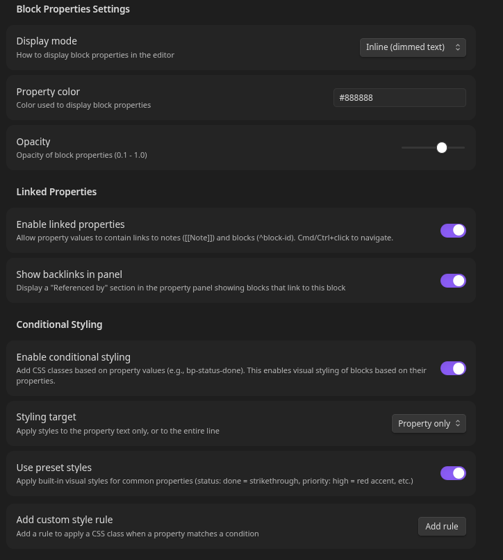

<div align="center">

# Block Properties

**Add metadata to individual blocks in Obsidian**

[](https://github.com/Querulantenkind/obsidian-block-properties-plugin/releases)
[](LICENSE)
[](https://obsidian.md)

*Extend block references with inline key-value properties*



</div>

---

## Quick Start

```markdown
Any paragraph with a block ID. ^my-block [status: draft, priority: high]
```

That's it. Properties appear after the block ID in `[key: value]` format.

---

## The Problem

Obsidian's properties exist only at the note level. But knowledge isn't atomic—notes contain structure, and that structure carries meaning:

- **Documentation**: Some sections are stable, others deprecated, others experimental
- **Long-form writing**: Different passages have different states, POVs, timelines
- **Research**: Claims from different sources have different confidence levels

There's no native way to attach metadata below the note level without fragmenting content into separate files.

## The Solution

Block Properties extends Obsidian's block reference syntax to support inline metadata:

```markdown
This section is stable. ^api-docs [status: stable, version: 2.0]

This needs review. ^draft-section [status: draft, reviewer: pending]
```

---

## Features

### Core

- **Inline Syntax** — Natural extension of existing `^block-id` syntax
- **Display Modes** — Inline (dimmed text) or Badge (compact count)
- **Hover Tooltips** — See all properties at a glance
- **Reading View** — Properties visible in both edit and reading mode
- **Query Command** — Find blocks by property across your vault

### Property Panel

- **Sidebar View** — All block properties in the current note
- **Inline Editing** — Click any value to edit directly
- **Quick Navigation** — Click block IDs to jump to location
- **Property Summary** — See which keys are used and how often

### Linked Properties

- **Note Links** — Reference notes with `[[Note]]` syntax
- **Block References** — Link blocks with `^block-id` syntax
- **Click Navigation** — Navigate links from panel or editor
- **Backlink Tracking** — See which blocks reference each other

### Conditional Styling

- **Auto CSS Classes** — Every property generates `bp-{key}-{value}`
- **Styling Target** — Apply to property text or entire line
- **Preset Styles** — Built-in styles for common patterns
- **Custom Rules** — Define your own key-value → class mappings

### Bulk Editing

- **Vault-Wide Changes** — Update properties across all files at once
- **Preview First** — See exactly which blocks will be affected
- **Value Filtering** — Target specific values or match any

### Block Graph View

- **Visualize Relationships** — See block connections as interactive graph
- **Auto Edge Detection** — Links like `blocked-by: ^task-2` become edges
- **Status Coloring** — Nodes colored by status property
- **Click Navigation** — Double-click to jump to any block

---

## Block Graph View

Visualize block-level relationships in a dedicated graph view.



### Opening the Graph

1. Open Command Palette (`Cmd/Ctrl + P`)
2. Search for **"Block Properties: Open block graph"**
3. The graph opens in a new tab

### How It Works

The graph scans your vault for blocks that reference other blocks:

```markdown
^task-1 [status: todo, blocked-by: ^task-2]
^task-2 [status: in-progress, depends-on: ^setup]
^setup [status: done]
```

This creates:
- **Nodes**: `^task-1`, `^task-2`, `^setup`
- **Edges**: task-1 → task-2 (blocked-by), task-2 → setup (depends-on)

### Graph Features

| Feature | Description |
|---------|-------------|
| **Interactive** | Drag nodes, zoom, pan |
| **Navigation** | Double-click to jump to block |
| **Tooltips** | Hover to see all properties |
| **Status Colors** | done=green, blocked=red, in-progress=blue |
| **Refresh** | Click ↻ to rebuild graph |
| **Themes** | Adapts to light/dark mode |

---

## Linked Properties

Property values can contain links to notes and blocks.



### Syntax

```markdown
Note links:
^task-1 [docs: [[Project Documentation]]]

Block references:
^subtask [blocked-by: ^parent-task]

Mixed:
^feature [spec: [[Design Doc]], depends: ^api-refactor]
```

### Navigation

| Location | Action |
|----------|--------|
| Property Panel | Click any link to navigate |
| Editor | `Cmd/Ctrl + Click` on link |

### Backlinks

The Property Panel shows a **"Referenced by"** section:

```
^parent-task [status: in-progress]

Referenced by:
  → subtask-1 (blocked-by)
  → subtask-2 (depends-on)
```

---

## Conditional Styling

Blocks automatically receive CSS classes based on property values.



### How It Works

Every property generates a class `bp-{key}-{value}`:

```markdown
^task-1 [status: done, priority: high]
→ Classes: bp-status-done, bp-priority-high
```

### Styling Target

| Target | Effect |
|--------|--------|
| **Property** | Only `[...]` text is styled |
| **Line** | Entire line/paragraph is styled |

### Preset Styles

| Property | Effect |
|----------|--------|
| `status: done` | Strikethrough, reduced opacity |
| `status: blocked` | Red left border |
| `status: in-progress` | Blue background tint |
| `priority: high` | Red text/background |
| `priority: low` | Reduced opacity |
| `type: deprecated` | Strikethrough, red, faded |
| `type: experimental` | Italic, purple tint |
| `status: draft` | Yellow background tint |

### Custom Rules

Define rules in Settings → add CSS in your snippets:

```css
.my-review-style {
  background: rgba(255, 200, 0, 0.2);
  border-left: 3px solid orange;
}
```

---

## Property Panel



### Features

- **Block Overview** — All blocks with properties at a glance
- **Context Preview** — Text before each block ID
- **Quick Navigation** — Click block ID to jump
- **Inline Editing** — Click value to modify with suggestions
- **Add/Delete** — Manage properties directly
- **Summary** — Statistics on property usage
- **Backlinks** — Incoming references (when enabled)

### Inline Editing

1. **Click** any property value
2. **Dropdown** appears with suggestions
3. **Enter** to save, **Escape** to cancel

---

## Bulk Editing

Change property values across your entire vault.

### Usage

1. Command Palette → **"Bulk edit properties"**
2. Select property key
3. Optionally filter by current value
4. Enter new value
5. **Preview** → **Apply**

### Example

```
Property key:    status
Current value:   draft
New value:       review

Preview: 15 blocks will be updated
├── notes/project.md → ^task-1
│   status: draft → review
└── ...
```

---

## Property Templates

Define reusable property sets in Settings:

```
Template: "task"
Properties: status: todo, priority: medium, assignee: (empty)
```

### Using Templates

**Via Command**: "Insert property template" opens picker

**Via Autocomplete**: Type `preset: task` → auto-expands to full template

---

## Syntax Reference

### Basic

```markdown
^block-id [key: value]
^block-id [key1: value1, key2: value2]
```

### With Links

```markdown
^block-id [ref: [[Note Name]]]
^block-id [depends: ^other-block]
^block-id [docs: [[Folder/Note]], blocked-by: ^task-1]
```

### Whitespace

```markdown
^id[key:value]           ✓ Works
^id [key: value]         ✓ Works
^id [ key : value ]      ✓ Works
```

### Special Characters

```markdown
^id [message: Hello, World]     ✗ Comma splits properties
^id [url: https://example.com]  ✓ Colons in values OK
```

---

## Commands

| Command | Description |
|---------|-------------|
| Insert block property | Add block property at cursor |
| Insert property template | Choose from saved templates |
| Query block properties | Search by property key/value |
| Open property panel | Show sidebar panel |
| Bulk edit properties | Change values across vault |
| Open block graph | Visualize block relationships |

---

## Settings



| Setting | Description |
|---------|-------------|
| **Display Mode** | Inline or Badge |
| **Property Color** | Color for property text |
| **Opacity** | Transparency (0.1–1.0) |
| **Enable linked properties** | Allow `[[Note]]` and `^block` in values |
| **Show backlinks** | Display "Referenced by" section |
| **Enable conditional styling** | Add CSS classes from properties |
| **Styling target** | Property only or entire line |
| **Use preset styles** | Built-in visual styles |
| **Custom rules** | Key-value → class mappings |
| **Auto-expand presets** | Expand `preset: name` automatically |
| **Templates** | Manage property templates |

---

## Installation

### Manual

1. Download latest release from [GitHub Releases](https://github.com/Querulantenkind/obsidian-block-properties-plugin/releases)
2. Extract to `.obsidian/plugins/block-properties/`
3. Enable in Settings → Community plugins

### BRAT

1. Install BRAT plugin
2. Add `Querulantenkind/obsidian-block-properties-plugin`
3. Enable Block Properties

### From Source

```bash
git clone https://github.com/Querulantenkind/obsidian-block-properties-plugin.git
cd obsidian-block-properties-plugin
npm install
npm run build
```

---

## Use Cases

### Project Management

```markdown
^setup-db [status: done, type: infrastructure]
^implement-api [status: in-progress, depends-on: ^setup-db]
^write-tests [status: blocked, blocked-by: ^implement-api]
```

### Documentation

```markdown
^auth-api [status: stable, version: 2.0]
^legacy-endpoint [status: deprecated, removed-in: v3.0]
```

### Research

```markdown
^hypothesis-a [status: testing]
^experiment-1 [supports: ^hypothesis-a, methodology: [[Methods]]]
^experiment-2 [contradicts: ^hypothesis-a]
```

### Creative Writing

```markdown
^scene-1 [draft: 2, pov: narrator, timeline: present]
^flashback [draft: 1, pov: maria, continues: ^scene-1]
```

---

## FAQ

**How is this different from YAML frontmatter?**
Frontmatter applies to entire notes. Block Properties apply to individual paragraphs or sections.

**Does it work with Dataview?**
Not yet. Dataview integration is planned. Use the built-in Query command for now.

**Will this break existing block references?**
No. Standard `^block-id` syntax works as before. Properties are additive.

**Can I link to blocks in other files?**
Yes. Block references search across your entire vault.

---

## Limitations

- No nested properties (values are plain strings)
- Properties must be on same line as block ID
- Commas in values not supported (splits properties)
- Backlinks are plugin-only (not in Obsidian's native backlinks)

---

## Roadmap

### Planned

- [ ] Dataview integration
- [ ] Property inheritance
- [ ] Typed properties (date picker, validation)
- [ ] Graph filtering by property
- [ ] Export/import

### Completed

- [x] Block Graph View *(v1.0.5)*
- [x] Bulk Editing *(v1.0.4)*
- [x] Conditional Styling *(v1.0.3)*
- [x] Linked Properties *(v1.0.2)*

---

## Changelog

### v1.0.5 — Block Graph View

- Interactive graph view for block relationships
- Automatic edge detection from block references
- Status-based node coloring
- Double-click navigation
- Theme support

### v1.0.4 — Bulk Editing

- Vault-wide property changes
- Preview before applying
- File-grouped updates

### v1.0.3 — Conditional Styling

- Auto CSS classes (`bp-{key}-{value}`)
- Preset styles for common patterns
- Custom style rules

### v1.0.2 — Linked Properties

- Note links in values (`[[Note]]`)
- Block references (`^block-id`)
- Backlink tracking
- Click navigation

### v1.0.1 — Templates & Panel Editing

- Property templates
- Inline editing in panel

### v1.0.0 — Initial Release

- Block property syntax
- Display modes
- Property panel
- Query command
- Autocomplete

---

## Contributing

Contributions welcome! Please open an issue first to discuss major changes.

## License

[MIT](LICENSE)

---

<div align="center">

**[GitHub](https://github.com/Querulantenkind/obsidian-block-properties-plugin)** · **[Codeberg](https://codeberg.org/Krampus/obsidian-block-properties-plugin)**

If you find this plugin useful, consider starring the repository!

</div>
